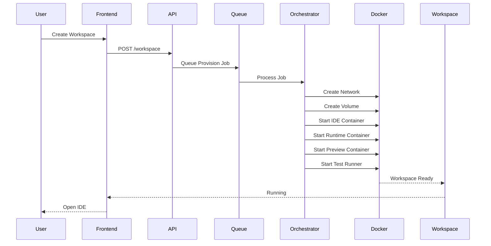
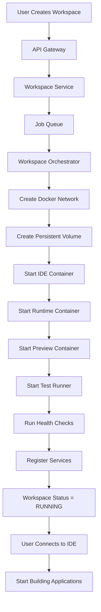

# 6. Container Runtime

## Overview

The Container Runtime is the execution layer of FiberDev Studio. It is 
responsible for provisioning, managing, and monitoring the isolated 
environments in which developers build, test, and debug Fiber 
applications.

Unlike traditional cloud IDEs that execute everything inside a single 
container, FiberDev Studio adopts a **multi-container workspace 
architecture**, where each workspace is composed of several specialized 
containers. Each container performs a dedicated responsibility while 
communicating securely over an isolated internal network.

This modular architecture provides:

- Better security through process isolation
- Improved scalability
- Independent service lifecycle management
- Easier debugging and monitoring
- Reusable runtime components
- Efficient resource allocation
- Support for future collaborative features

---

# Architecture Overview

Each developer workspace consists of the following containers:

```
Workspace
│
├── IDE Container
├── Fiber Runtime Container
├── Preview Container
└── Test Runner Container
```

All containers share:

- Persistent Workspace Volume
- Internal Docker Network
- Environment Variables
- Secret Store
- Logging Service

Each workspace is completely isolated from every other workspace.

---

# Workspace Runtime Layout

```text
                    Workspace
                        │
        
┌───────────────┼────────────────┐
        │               │                │
        ▼               ▼                ▼
 IDE Container   Runtime Container   Preview Container
        │               │                │
        
└───────────────┼────────────────┘
                        │
                Test Runner Container
                        │
                        ▼
              Shared Persistent Volume
```

---

# Container Responsibilities

## 1. IDE Container

The IDE Container provides the browser-based development environment that 
developers interact with.

This container is responsible for:

- Monaco Editor / VS Code Server
- File explorer
- Extension host
- Language Server Protocol (LSP)
- Git integration
- Workspace settings
- Terminal frontend

### Installed Components

- VS Code Server
- Monaco Editor
- Git
- Node.js
- Language Servers
- File Watcher

### Responsibilities

- Open project files
- Edit source code
- Display diagnostics
- Connect to runtime services
- Stream terminal sessions

---

## 2. Fiber Runtime Container

The Runtime Container contains the complete Fiber development stack.

This is where application code is compiled and executed.

### Installed Components

- Fiber CLI
- Rust Toolchain
- Cargo
- CKB Node
- CKB Indexer
- Molecule Compiler
- Smart Contract Toolchain
- Build Utilities

### Responsibilities

- Compile projects
- Execute build commands
- Deploy smart contracts
- Manage local blockchain state
- Execute CLI commands
- Run backend services

The Runtime Container exposes APIs internally to the IDE Container.

Example commands:

```bash
cargo build

cargo test

fiber init

fiber run

ckb-cli
```

---

## 3. Preview Container

The Preview Container serves applications running inside the workspace.

Whenever a developer starts a local server, the Preview Container proxies 
traffic securely back to the browser.

Examples:

- React applications
- Next.js
- Vue
- APIs
- Documentation servers

Responsibilities:

- HTTP Proxy
- HTTPS Proxy
- SSL termination
- Port forwarding
- Preview URL generation

Example

```
localhost:3000
```

becomes

```
workspace-4f72.preview.fiberdev.io
```

---

## 4. Test Runner Container

Testing workloads are isolated from the development environment.

Responsibilities include:

- Unit Tests
- Integration Tests
- Smart Contract Tests
- Benchmark Tests
- Coverage Reports

Installed tools include:

- Cargo Test
- Jest
- Playwright
- Coverage utilities

---

# Shared Components

## Persistent Workspace Volume

All containers mount the same workspace volume.

```
/workspace
```

This directory contains:

```
project/

Cargo.toml

README.md

contracts/

src/

tests/

node_modules/

target/
```

Advantages

- Files are immediately visible across containers.
- No synchronization required.
- Fast rebuilds.
- Persistent across restarts.

---

## Internal Workspace Network

Every workspace receives its own isolated Docker network.

Example

```
workspace_72_net
```

Only containers belonging to the same workspace may communicate.

Example

```
IDE
↓

Runtime

↓

Preview

↓

Test Runner
```

No communication exists between different workspaces.

---

## Environment Variables

Sensitive configuration is injected during startup.

Examples

```
WORKSPACE_ID

USER_ID

CKB_RPC_URL

FIBER_NETWORK

DATABASE_URL

API_TOKEN
```

Secrets are never baked into Docker images.

---

## Logging

Each container streams logs into a centralized logging pipeline.

Sources include:

- stdout
- stderr
- build logs
- runtime logs
- terminal logs

These logs are stored for:

- debugging
- audit
- monitoring

---

# Container Communication

```text
IDE Container
      │
      ▼
Runtime Container
      │
      ├────────► Build
      ├────────► Run
      ├────────► Deploy
      │
      ▼
Preview Container
      │
      ▼
Browser Preview

Runtime Container
      │
      ▼
Test Runner
```

Communication occurs only over the internal workspace network.

---

# Resource Isolation

Every workspace is allocated dedicated resources.

Example

| Resource | Allocation |
|----------|------------|
| CPU | 2 vCPU |
| Memory | 4 GB |
| Storage | 20 GB |
| Network | Isolated |
| Volume | Dedicated |

These limits prevent one workspace from affecting another.

---

# Workspace Provisioning Workflow

When a user creates a workspace, the following sequence occurs.



---

# Container Runtime Workflow



---

# Health Monitoring

The orchestrator continuously monitors every running container.

Checks include:

- CPU usage
- Memory usage
- Disk usage
- Container health
- Running processes
- Open ports
- Build status

If a container becomes unhealthy:

1. Mark unhealthy
2. Collect logs
3. Restart container
4. Restore workspace state
5. Notify the user if recovery fails

---

# Future Improvements

The runtime architecture is designed to support future capabilities 
without significant redesign.

Planned enhancements include:

- Kubernetes-based scheduling
- GPU-enabled workspaces
- Collaborative development sessions
- Workspace snapshots and restoration
- Auto-scaling runtime nodes
- Distributed build workers
- Remote debugging support
- Multi-region workspace deployment
- Custom runtime images
- Persistent development environments

---

# Summary

The Container Runtime is the execution backbone of FiberDev Studio. By 
decomposing each workspace into multiple specialized containers—IDE, 
Runtime, Preview, and Test Runner—the platform achieves strong isolation, 
modularity, scalability, and maintainability. Shared persistent storage, 
isolated networking, centralized logging, and orchestration services 
ensure that every developer receives a secure, reproducible, and 
production-grade cloud development environment while enabling future 
expansion to collaborative and enterprise-scale workloads.
# launchFiber-backend
